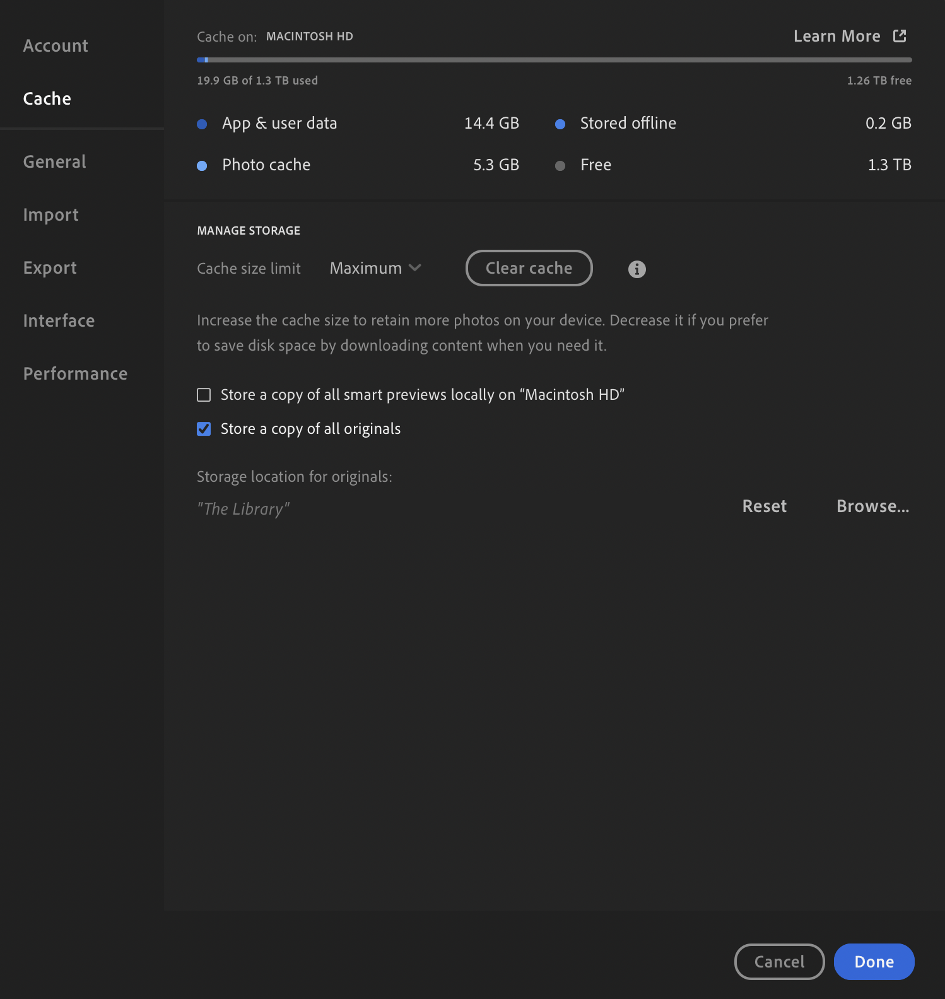

# LRCC Library Parser

This is an extremely janky tool used to help back up your LRCC photos while maintaining the album structure.

By default, saving originals locally arranges the photos into YYYY/YYYY-MM-DD folders, and this tool gives you a mapping of albums to lists of files.

# How to use



1. Store a copy of your originals locally (see above)
2. Wait for all of the photos to be downloaded

```bash
npm install lrcc-parser
```

```javascript

const { parseLibrary } = require("lrcc-parser");

(async () => {
  const { albums } = await parseLibrary("/Users/me/Pictures/Lightroom Library.lrlibrary/somelonghash/Managed Catalog.mcat");
  console.log(albums);
})();
```

You should get something like:

```json
{
  "1999/1999-07-01 Oldies": [ 
    "1999/1999-07-01/1.jpg", 
    "1999/1999-07-01/2.jpg"
  ],
  "2002/2002-05-21 Family Trip": [
    "2002/2002-05-21/2002-05-21-0005.jpg",
    "2002/2002-05-21/2002-05-21-0004.jpg",
  ],
  "2002/2002-05-22 Tennis": [
    "2002/2002-05-22/2002-05-22-0013.jpg",
    "2002/2002-05-22/2002-05-22-0012.jpg",
    "2002/2002-05-22/2002-05-22-0011.jpg",
    "2002/2002-05-22/2002-05-22-0007.jpg",
    "2002/2002-05-22/2002-05-22-0008.jpg",
    "2002/2002-05-22/2002-05-22-0004.jpg",
    "2002/2002-05-22/2002-05-22-0009.jpg",
    "2002/2002-05-22/2002-05-22-0006.jpg",
    "2002/2002-05-22/2002-05-22-0005.jpg",
    "2002/2002-05-22/2002-05-22-0002.jpg",
    "2002/2002-05-22/2002-05-22-0003.jpg",
    "2002/2002-05-22/2002-05-22-0001.jpg",
    "2002/2002-05-21/2002-05-21-0025.jpg"
  ]
}
```

The files will be found wherever you chose to store originals (see step 1).